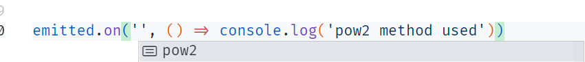

#Small and simple event emitter


**Uses ES6 Proxies**

Works pretty easy

```js
import makeEmitted from 'make-emitted'

const someObject = {
  a: 5,
  pow2: (a) => a ** 2
}

const emitted = makeEmitted(someObject)

const id = emitted.on('pow2', () => console.log('pow2 method used'))

emitted.pow2() // pow2 method used
someObject.pow2() // Z-z-z
emitted.pow2() // pow2 method used

emitted.off(id)
emitted.pow2() // Z-z-z
```

## Autocompletion by typescript
